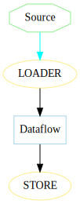
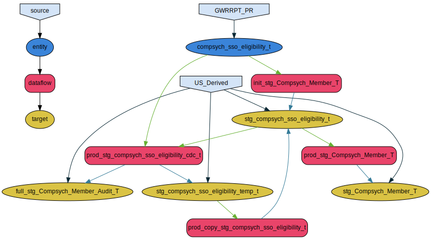

# podium-dataflow-dependency-tree

Describes a method of generating a graphical representation
of a Podium dataflow's dependency tree

This uses a Jupyter Notebook using Python as the engine, the
source and full description of the process used to generate
the tree below is in the `Prepare_Dependency_Gen.ipynb` in
this Github repository.

In the sample output shown the focus was on the
`prod_stg_compsych_member_t` dataflow. The code in the
Jupyter Notebook shows how using the Podium metadata
repository that the ancestors of the dataflow can be
determined from it's LOADERs. 

Possible uses for this information are:

* documenting process flows
* creating information for scheduling purposes
* etc

