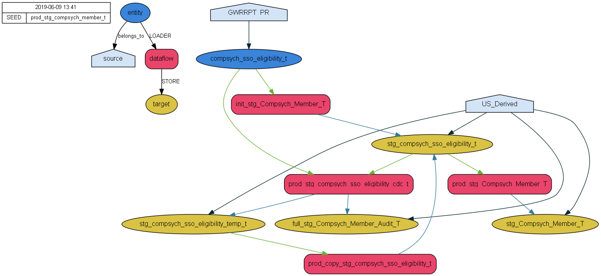

# podium-dataflow-dependency-tree
Describes a method of generating a representation of a Podium dataflow's dependency tree

This uses a Jupyter Notebook using Python as the engine, the source and description of the process used to generate the tree below is in the `Prepare_Dependency_Gen.ipynb` in this Github repository.

